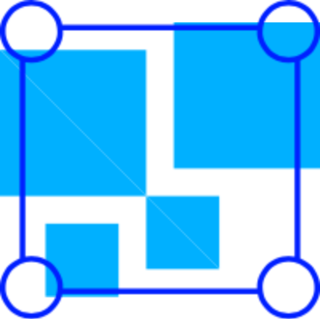

<p align="center">
  
</p>
                                                  
# Kubernetes Ops Box

Kubernetes Ops Box is the docker image with necessary tools for kubernetes operations including build, template, package, lint, analyze and security audit. This Kubernetes Ops Box is especially made to do operations in kubernetes that brings set of standards together on develop and managing kubernetes environment.

- [Kubernetes Ops Box](#kubernetes-ops-box)
  - [How to pull image?](#how-to-pull-image)
  - [How to run the image?](#how-to-run-the-image)
  - [Tools](#tools)
  - [Build and Ship](#build-and-ship)
    - [Docker CLI, Kubectl, KubeAdm](#docker-cli-kubectl-kubeadm)
    - [Linting Docker files - Hadolint](#linting-docker-files---hadolint)
    - [Analyzing Docker Layers - Dive](#analyzing-docker-layers---dive)
    - [Dev tools](#dev-tools)
  - [Infrastructure as code](#infrastructure-as-code)
    - [Terraform](#terraform)
  - [Package management](#package-management)
    - [Helm](#helm)
  - [Monitor](#monitor)
    - [Kube Shell](#kube-shell)
    - [Kubebox](#kubebox)
  - [Static analysis / Audit tool](#static-analysis--audit-tool)
    - [Kube Score](#kube-score)
    - [Kube Audit](#kube-audit)
  - [Contributing](#contributing)
  - [Pull Request Process](#pull-request-process)
  - [Credits](#credits)


The github package registry contains three different docker images
    
| Image | URL                                                      | Tag    | Description                                                                  |
| ----- | -------------------------------------------------------- | ------ | ---------------------------------------------------------------------------- |
| Base  | docker.pkg.github.com/ksivamuthu/k8s-ops-box/k8s-ops     | latest | This image contains kubectl, kubeadm, terraform, helm and etc.               |
| EKS   | docker.pkg.github.com/ksivamuthu/k8s-ops-box/k8s-ops-eks | latest | This contains the base tools and AWS CLI to do aws cloud cli operations.     |
| AKS   | docker.pkg.github.com/ksivamuthu/k8s-ops-box/k8s-ops-aks | latest | This contains the base tools and Azure CLI to do Azure cloud cli operations. |

## How to pull image?

1. Create a github personal access token with read packages permission.
2. Login in docker using below command.
   ```
   docker login -u <github_user_name> -p <personal_access_token>
   ```
3. Pull the required images.
   ```
   docker pull docker.pkg.github.com/ksivamuthu/k8s-ops-box/k8s-ops:latest
   ```

## How to run the image?

1. Run the image with the below command.

 ```bash
 docker run -it -v /var/run/docker.sock:/var/run/docker.sock -v /YOUR_LOCAL_FOLDER/.kube:/root/.kube docker.pkg.github.com/ksivamuthu/k8s-ops-box/k8s-ops:latest
 ```
 
2. If you want to connect with EKS, run the image with the below command

```bash

 docker run -it -v /var/run/docker.sock:/var/run/docker.sock -v /YOUR_LOCAL_FOLDER/.kube:/root/.kube -v /YOUR_LOCAL_FOLDER/.aws:/root/.aws docker.pkg.github.com/ksivamuthu/k8s-ops-box/k8s-ops-eks:latest
```

## Tools

## Build and Ship

### Docker CLI, Kubectl, KubeAdm

This *k8s-ops-box* includes docker cli, kubectl and kubeadm installed. It still uses host docker to build the images. You've to mount docker.sock when you are running this box to give access to docker-cli to build the images.

### Linting Docker files - Hadolint

Do you want to lint your dockerfile? Hadolint is the superpower lint tool that lints the docker file and suggests the best practices to follow and to avoid security issues.

```
hadolint <Dockerfile>
```

### Analyzing Docker Layers - Dive

A most useful tool for exploring a docker image, layer contents, and discovering ways to shrink the size of your Docker/OCI image.


Run the below command to analyze docker layers.

```bash
dive <image_name>
```

### Dev tools

This *k8s-ops-box* comes with necessary dev tools or command line tools that requires kubernetes operations. It has vim editor, jq for JSON parsing, curl for requests, git for version control, unzip/tar for unzipping files and python3/pip installed for basic operations.

## Infrastructure as code  

### Terraform

Terraform is the infrastructure-as-code tool for building, changing, and versioning infrastructure safely and efficiently. Terraform can manage existing and popular service providers as well as custom in-house solutions.

## Package management 

### Helm

Helm is a tool that streamlines installing and managing Kubernetes applications. Think of it like apt/yum/homebrew for Kubernetes.

## Monitor

### Kube Shell

An integrated shell for working with the Kubernetes CLI is installed in this *k8s-ops-box* and that's the main entrypoint of the docker image. This kube-shell includes auto completion, fish style command support and other cool features. This is one of the must have tool when you are using lot of kubectl commands to query your cluster.


### Kubebox

Terminal console for Kubernetes. Check memory/cpu, logs of all your pods from the command line.

```bash
kubebox
```


## Static analysis / Audit tool

### Kube Score

kube-score is a tool that performs static code analysis of your Kubernetes object definitions. The output is a list of recommendations of what you can improve to make your application more secure and resilient.

Checks:
* Container limits (should be set)
* Pod is targeted by a NetworkPolicy, both egress and ingress rules are recommended
* Deployments and StatefulSets should have a PodDisruptionPolicy
* Deployments and StatefulSets should have host PodAntiAffinity configured
* Container probes, both readiness and liveness checks should be configured, and should not be identical
* Container securityContext, run as high number user/group, do not run as root or with privileged root fs
* Stable APIs, use a stable API if available (supported: Deployments, StatefulSets, DaemonSet)

Example with helm:

```
helm template my-app | kube-score score -
```

Static yamls:

```
kube-score score my-app/*.yaml
```

### Kube Audit

kubeaudit is a command line tool to audit Kubernetes clusters for various different security concerns: run the container as a non-root user, use a read only root filesystem, drop scary capabilities, don't add new ones, don't run privileged, ... You get the gist of it and more on that later. 

```
kubeaudit all
```


## Contributing

When contributing to this repository, please first discuss the change you wish to make via issue, email, or any other method with the owners of this repository before making a change.

Please note we have a code of conduct, please follow it in all your interactions with the project.

## Pull Request Process

* Ensure the docker images is built successfully
* Make sure, the new tool we are adding in this kubernetes box is evaluated.
* Update the README.md with details of changes to the interface, this includes new environment variables, exposed ports, useful file locations and container parameters.
* You may merge the Pull Request in once you have the sign-off of one other developer, or if you do not have permission to do that, you may request the second reviewer to merge it for you.

## Credits

Credits go to these all fantastic open-source tools that help this kubernetes development lot easier. This repository is just the docker box with all useful tools installed. In the future, the custom script may be added to this box to enhance our kubernetes ops.
